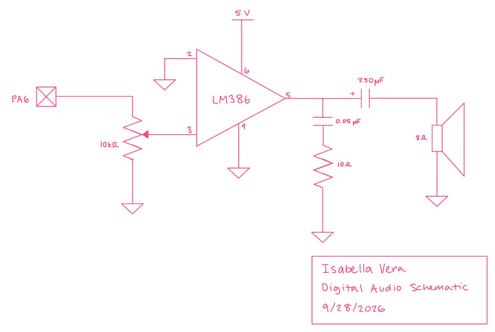
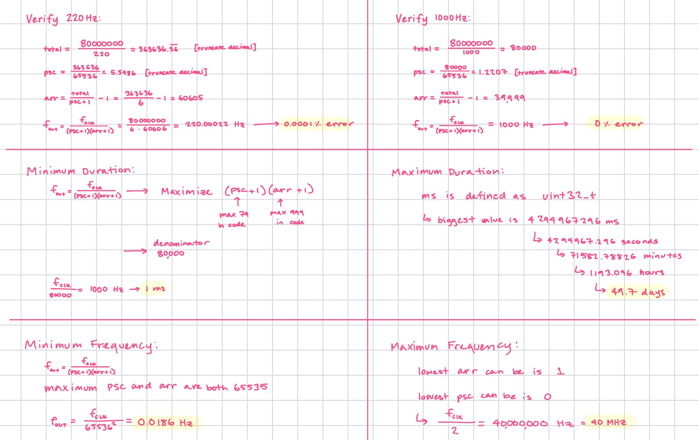
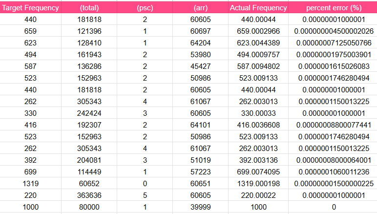

## Introduction
In this lab I will use the MCU to play music by using timers to generate square waves and toggling a GPIO pin at a specific frequency for specified durations.

## Technical Documentation
The source code for the project can be found in the associated [Github repository](https://github.com/isabella-vera/E155/tree/main/Lab4)

### Schematic

### Calculations
A timer is a counter that ticks up at a steady rate, and when it reaches a set limit it goes back to zero. Each wrap is one "cycle." The prescaler and auto-reload value together determine how fast that happens. The prescaler slows the incoming 80 MHz clock down, so the counter only ticks once every so many clock pulses. The auto-reload value sets how many ticks the counter counts before wrapping. 

For note duration I used TIM15. I set the prescaler to 79, so the counter ticks once every 80 clock pulses, which is 1 million ticks per second, or one tick per microsecond. I set the auto-reloadlimit to 999, so the counter counts 1000 ticks (1000 microseconds or 1 millisecond) and before resetting to zero. 

delay_ms just waits for the timer to announce a wrap and counts them. A 125 ms note means waiting for 125 wraps. So note length in milliseconds equals the number of wraps you wait for.

To get the the pitches I usedTIM16. The timer generates a square wave (PWM) to produce the sound. The output pin is high for the first half of each cycle and low for the second half, which makes a square wave. The pitch that you hear is how many of these cycles happen per second.

Checking at 220 Hz and 1000 Hz is not sufficient to prove that all notes are within error bounds. This is because most of the error comes from the fact that the prescaler and auto-reload values are integers, and desired frequencies are not all exactly integers.

## Conclusion
I spent about twelve hours working on this lab.

## AI Prototype Summary
I asked Gemini "What timers should I use on the STM32L432KC to generate frequencies ranging from 220Hz to 1kHz? What’s the best choice of timer if I want to easily connect it to a GPIO pin? What formulae are relevant, and what registers need to be set to configure them properly?"

It gave the following response:
"To generate audio frequencies from 220Hz (A3 note) to 1kHz on the STM32L432KC (commonly found on the Nucleo-32 board), general-purpose timers TIM2, TIM15, or TIM16 are ideal choices."

It also provided guidance on why these timers are suitable with governing calculations for frequency. I used TIM15 and TIM16, but I was surprised that these were the ones recommended since the I heard more often that using TIM6 and TIM7 was more efficient for this lab. I think AI can be helpful to guide the selection of timers as it can quickly synthesize information that is otherwise scattered across datasheets and reference manuals.

